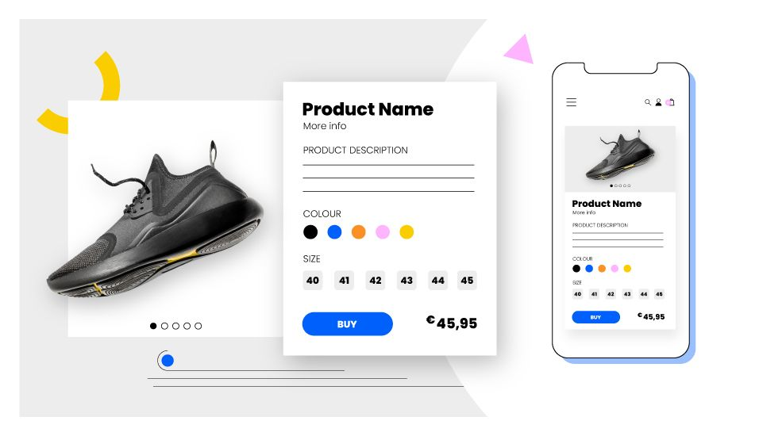

# Product Page Project

## Overview

This is a React-based product page project, built using Vite and TypeScript. It provides a modern, efficient development environment for creating dynamic and responsive product pages.

## Design



## Project Structure

The project is organized as follows:

- `src/`: Contains the source code for the project
- `vite.config.ts`: Configuration file for Vite
- `tsconfig.app.json`, `tsconfig.json`, `tsconfig.node.json`: TypeScript configuration files

## Dependencies

This project relies on the following key dependencies:

- React: ^18.3.1
- React DOM: ^18.3.1
- Vite: ^4.3.3 (with @vitejs/plugin-react)
- TypeScript: ~5.6.2
- ESLint: ^9.13.0
- Tailwind CSS: ^3.4.14
- PostCSS: ^8.4.47
- Autoprefixer: ^10.4.20

## Scripts

The following npm scripts are available:

- `dev`: Starts the development server using Vite
- `build`: Builds the project using Vite and TypeScript
- `lint`: Runs ESLint on the project
- `preview`: Previews the built project using Vite

## Getting Started

To get started with the project, follow these steps:

1. Clone the repository to your local machine.

2. Install the dependencies:
   ```
   npm install
   ```

3. Start the development server:
   ```
   npm run dev
   ```

   This will launch the server and open the project in your default browser.

## Development

During development, you can take advantage of Vite's fast hot module replacement (HMR) and TypeScript's static typing to build your product page efficiently.

## Building for Production

To create a production-ready build, run:

```
npm run build
```
